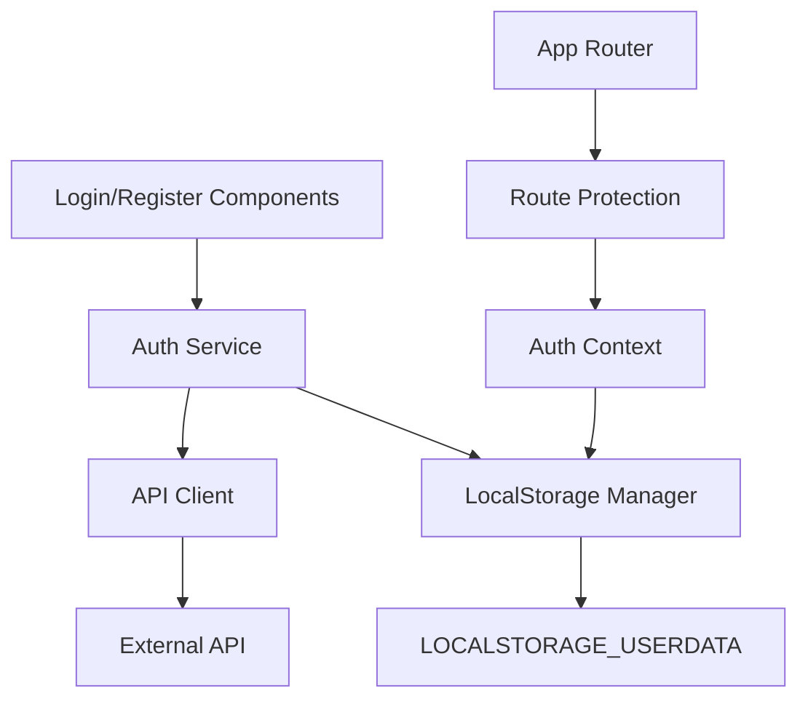

# Design Document

## Overview

Este documento descreve o design para simplificar o sistema de autenticação do projeto, mantendo apenas as funcionalidades essenciais de login, registro e proteção de rotas. O design foca em criar uma arquitetura limpa e minimalista que utiliza a API existente e armazena dados no localStorage com a chave LOCALSTORAGE_USERDATA.

## Architecture

### Simplified Architecture Diagram



### Core Principles

1. **Minimalism**: Remover toda complexidade desnecessária
2. **Single Responsibility**: Cada módulo tem uma responsabilidade clara
3. **Consistency**: Usar sempre LOCALSTORAGE_USERDATA como chave
4. **Simplicity**: Código fácil de entender e manter

## Components and Interfaces

### 1. Simplified Auth Service

**Responsabilidade**: Gerenciar autenticação de forma simples e direta

```typescript
interface AuthService {
  login(credentials: LoginCredentials): Promise<AuthResponse>
  register(userData: RegisterData): Promise<AuthResponse>
  logout(): void
  isAuthenticated(): boolean
  getCurrentUser(): User | null
  getToken(): string | null
}
```

**Características**:
- Remove complexidade de verificação automática de token
- Foca apenas nas operações essenciais
- Usa localStorage diretamente com LOCALSTORAGE_USERDATA

### 2. Simplified Auth Context

**Responsabilidade**: Prover estado de autenticação para componentes

```typescript
interface AuthContextType {
  user: User | null
  isAuthenticated: boolean
  isLoading: boolean
  login: (credentials: LoginCredentials) => Promise<void>
  register: (userData: RegisterData) => Promise<void>
  logout: () => void
}
```

**Características**:
- Estado mínimo necessário
- Sem verificações automáticas complexas
- Sem cache ou otimizações desnecessárias

### 3. Route Protection Component

**Responsabilidade**: Proteger rotas que requerem autenticação

```typescript
interface ProtectedRouteProps {
  children: React.ReactNode
  redirectTo?: string
}
```

**Características**:
- Verificação simples de autenticação
- Redirecionamento direto para login se não autenticado
- Sem loading states complexos

### 4. Login/Register Forms

**Responsabilidade**: Interfaces simples para autenticação

**Características**:
- Formulários básicos sem validações complexas
- Feedback de erro simples
- Integração direta com Auth Service

## Data Models

### User Data Structure (LOCALSTORAGE_USERDATA)

```typescript
interface StoredAuthData {
  token: string
  expiresIn: string
  user: {
    id: string
    fullName: string
    email: string
    userType: 'client' | 'provider'
    balance: number
    createdAt: string
    isActive: boolean
  }
}
```

### API Request/Response Models

**Login Request**:
```typescript
{
  email: string
  password: string
}
```

**Register Request**:
```typescript
{
  fullName: string
  nif: string
  email: string
  password: string
  userType: 'client' | 'provider'
  phone: string
}
```

**API Response**:
```typescript
{
  success: boolean
  message: string
  data: {
    token: string
    expiresIn: string
    user: User
  }
}
```

## Error Handling

### Simplified Error Strategy

1. **Network Errors**: Mostrar mensagem genérica "Erro de conexão"
2. **Validation Errors**: Mostrar mensagem específica da API
3. **Authentication Errors**: Limpar localStorage e redirecionar para login
4. **Unknown Errors**: Mostrar mensagem genérica "Algo deu errado"

### Error Display

- Toast notifications simples
- Sem retry automático
- Sem error boundaries complexos

## Testing Strategy

### Unit Tests (Opcional)

1. **Auth Service Tests**:
   - Login com credenciais válidas
   - Register com dados válidos
   - Logout limpa localStorage
   - isAuthenticated retorna valor correto

2. **Component Tests**:
   - ProtectedRoute redireciona quando não autenticado
   - Login form submete dados corretos
   - Register form submete dados corretos

### Integration Tests (Opcional)

1. **Auth Flow Tests**:
   - Login completo até redirecionamento
   - Register completo até redirecionamento
   - Logout completo até limpeza de estado

## Implementation Details

### File Structure Simplificada

```
src/
├── components/
│   ├── auth/
│   │   ├── LoginForm.tsx
│   │   ├── RegisterForm.tsx
│   │   └── ProtectedRoute.tsx
│   └── ui/ (manter componentes UI existentes)
├── services/
│   └── authService.ts (simplificado)
├── context/
│   └── AuthContext.tsx
├── types/
│   └── auth.ts (simplificado)
├── utils/
│   └── localStorage.ts (simplificado)
└── hooks/
    └── useAuth.ts (simplificado)
```

### Removed Components

- Complexo sistema de stores (Zustand)
- Token service com verificação automática
- Auth repository com cache
- Error service complexo
- Retry service
- Cache service
- Validation service complexo
- Memoization service

### API Integration

**Base URL**: Usar a mesma configuração existente
**Endpoints**:
- POST `/auth/login`
- POST `/auth/register`

**Headers**:
```typescript
{
  "Content-Type": "application/json",
  "Authorization": "Bearer {token}" // apenas quando necessário
}
```

### LocalStorage Management

**Key**: `LOCALSTORAGE_USERDATA`
**Operations**:
- `setAuthData(data)`: Salvar dados completos de autenticação
- `getAuthData()`: Recuperar dados de autenticação
- `clearAuthData()`: Limpar dados de autenticação
- `isAuthenticated()`: Verificar se usuário está autenticado

### Route Protection Strategy

1. **Public Routes**: Login, Register, Home (se aplicável)
2. **Protected Routes**: Todas as outras rotas
3. **Redirect Logic**: Não autenticado → Login, Autenticado → Dashboard/Home

### State Management

**Approach**: React Context simples
**State**:
- `user`: Dados do usuário atual
- `isAuthenticated`: Boolean de autenticação
- `isLoading`: Boolean para operações async

**No Global State**: Sem Redux, Zustand ou outras bibliotecas de estado global complexas

## Security Considerations

1. **Token Storage**: localStorage (aceitar limitações de segurança para simplicidade)
2. **Token Validation**: Apenas verificação local de existência
3. **Route Protection**: Verificação simples no frontend
4. **Logout**: Limpeza completa do localStorage

## Performance Considerations

1. **No Caching**: Remover todos os sistemas de cache
2. **No Optimization**: Focar em simplicidade sobre performance
3. **Direct API Calls**: Sem layers de abstração desnecessários
4. **Minimal Re-renders**: Context otimizado para evitar re-renders desnecessários

## Migration Strategy

1. **Phase 1**: Criar novos componentes simplificados
2. **Phase 2**: Substituir componentes existentes
3. **Phase 3**: Remover código não utilizado
4. **Phase 4**: Atualizar rotas e navegação
5. **Phase 5**: Testes e validação final