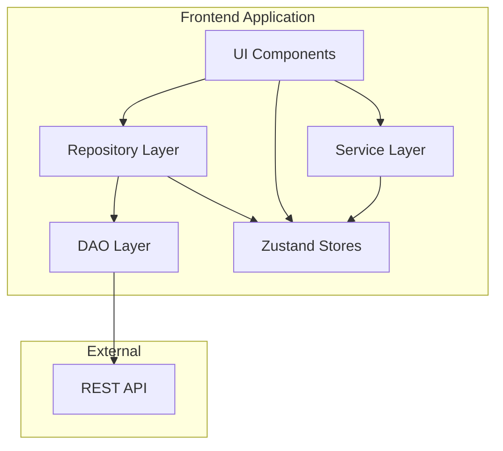

# Design Document

## Overview

The Service Provider Platform is a React-based web application that enables service providers to offer their services and clients to book and pay for these services. The application follows a modern architecture using TypeScript, Chakra UI v3, Zustand for state management, and implements the DAO/Repository pattern as specified in the development guide.

### Key Technologies
- **Frontend Framework**: React 19 with TypeScript
- **UI Library**: Chakra UI v3 with emotion
- **State Management**: Zustand
- **Build Tool**: Vite
- **HTTP Client**: Fetch API
- **Authentication**: JWT tokens
- **Styling**: Chakra UI tokens and responsive design

## Architecture

### High-Level Architecture



### Folder Structure

```
src/
├── dao/                    # Data Access Objects
│   ├── authDao.ts
│   ├── userDao.ts
│   ├── serviceDao.ts
│   └── bookingDao.ts
├── repositories/           # Business logic and state management
│   ├── authRepository.ts
│   ├── userRepository.ts
│   ├── serviceRepository.ts
│   └── bookingRepository.ts
├── stores/                 # Zustand stores and UI state hooks
│   ├── authStore.ts
│   ├── userStore.ts
│   ├── serviceStore.ts
│   └── bookingStore.ts
├── types/                  # TypeScript type definitions
│   ├── auth.ts
│   ├── user.ts
│   ├── service.ts
│   └── booking.ts
├── services/               # Cross-cutting concerns
│   ├── apiClient.ts
│   ├── tokenService.ts
│   └── validationService.ts
├── ui/                     # React components
│   ├── components/         # Reusable components
│   ├── pages/             # Page components
│   ├── layouts/           # Layout components
│   └── forms/             # Form components
├── utils/                  # Utility functions
│   ├── formatters.ts
│   ├── validators.ts
│   └── constants.ts
└── hooks/                  # Custom React hooks
    ├── useAuth.ts
    ├── useServices.ts
    └── useBookings.ts
```

## Components and Interfaces

### Core Data Types

```typescript
// User Types
interface User {
  id: string;
  fullName: string;
  email: string;
  nif: string;
  userType: 'client' | 'provider';
  balance: number;
  isActive: boolean;
  createdAt: string;
}

interface AuthResponse {
  token: string;
  expiresIn: string;
  user: User;
}

// Service Types
interface Service {
  id: string;
  name: string;
  description: string;
  price: number;
  providerId: string;
  providerName: string;
  isActive: boolean;
  createdAt: string;
  updatedAt: string;
}

interface ServiceFilters {
  search?: string;
  minPrice?: number;
  maxPrice?: number;
  sortBy?: 'name' | 'price' | 'createdAt';
  sortOrder?: 'asc' | 'desc';
  limit?: number;
  offset?: number;
}

// Booking Types
interface Booking {
  id: string;
  clientId: string;
  clientName: string;
  serviceId: string;
  serviceName: string;
  providerId: string;
  providerName: string;
  amount: number;
  status: 'confirmed' | 'cancelled';
  createdAt: string;
  cancelledAt?: string;
  cancellationReason?: string;
}
```

### DAO Layer

Each DAO handles HTTP communication with the API:

```typescript
// Example: authDao.ts
export async function loginUser(credentials: LoginCredentials): Promise<AuthResponse> {
  const response = await apiClient.post('/auth/login', credentials);
  return response.data;
}

export async function registerUser(userData: RegisterData): Promise<AuthResponse> {
  const response = await apiClient.post('/auth/register', userData);
  return response.data;
}
```

### Repository Layer

Repositories orchestrate business logic and update stores:

```typescript
// Example: authRepository.ts
export class AuthRepository {
  async login(credentials: LoginCredentials) {
    const { setUser, setToken, setIsAuthenticated } = useAuthStore();
    
    try {
      const response = await authDao.loginUser(credentials);
      setToken(response.token);
      setUser(response.user);
      setIsAuthenticated(true);
      tokenService.saveToken(response.token);
      return response;
    } catch (error) {
      throw new Error('Login failed: ' + error.message);
    }
  }
}
```

### Store Layer (Zustand)

Each domain has a dedicated store following the pattern:

```typescript
// Example: authStore.ts
interface AuthState {
  user: User | null;
  token: string | null;
  isAuthenticated: boolean;
  isLoading: boolean;
  error: string | null;
}

interface AuthActions {
  setUser: (user: User | null) => void;
  setToken: (token: string | null) => void;
  setIsAuthenticated: (isAuth: boolean) => void;
  setLoading: (loading: boolean) => void;
  setError: (error: string | null) => void;
  logout: () => void;
}

export const useAuthStore = create<AuthState & AuthActions>((set) => ({
  // State
  user: null,
  token: tokenService.getToken(),
  isAuthenticated: false,
  isLoading: false,
  error: null,
  
  // Actions
  setUser: (user) => set({ user }),
  setToken: (token) => set({ token }),
  setIsAuthenticated: (isAuthenticated) => set({ isAuthenticated }),
  setLoading: (isLoading) => set({ isLoading }),
  setError: (error) => set({ error }),
  logout: () => set({ 
    user: null, 
    token: null, 
    isAuthenticated: false,
    error: null 
  }),
}));
```

### UI Components Architecture

#### Layout Components
- **AppLayout**: Main application wrapper with navigation
- **AuthLayout**: Layout for authentication pages
- **DashboardLayout**: Layout for authenticated user pages

#### Page Components
- **LoginPage**: User authentication
- **RegisterPage**: User registration
- **DashboardPage**: Role-specific dashboard
- **ServicesPage**: Service browsing (clients) / management (providers)
- **BookingsPage**: Booking management
- **TransactionHistoryPage**: Transaction history
- **ProfilePage**: User profile management

#### Reusable Components
- **ServiceCard**: Display service information
- **BookingCard**: Display booking information
- **TransactionCard**: Display transaction information
- **LoadingSpinner**: Loading indicator
- **ErrorAlert**: Error message display
- **ConfirmDialog**: Confirmation dialogs
- **SearchBar**: Search functionality
- **FilterPanel**: Filtering options
- **PaginationControls**: Pagination navigation

## Data Models

### API Response Wrapper
```typescript
interface ApiResponse<T> {
  success: boolean;
  message: string;
  data: T;
  error?: string;
  code?: string;
}
```

### Form Data Models
```typescript
interface LoginForm {
  identifier: string; // email or NIF
  password: string;
}

interface RegisterForm {
  fullName: string;
  nif: string;
  email: string;
  password: string;
  confirmPassword: string;
  userType: 'client' | 'provider';
}

interface ServiceForm {
  name: string;
  description: string;
  price: number;
}
```

### UI State Models
```typescript
interface ServiceListState {
  services: Service[];
  filters: ServiceFilters;
  isLoading: boolean;
  error: string | null;
  total: number;
  hasMore: boolean;
}

interface BookingListState {
  bookings: Booking[];
  isLoading: boolean;
  error: string | null;
  total: number;
}
```

## Error Handling

### Error Types
```typescript
enum ErrorType {
  VALIDATION_ERROR = 'VALIDATION_ERROR',
  AUTHENTICATION_ERROR = 'AUTHENTICATION_ERROR',
  AUTHORIZATION_ERROR = 'AUTHORIZATION_ERROR',
  NOT_FOUND = 'NOT_FOUND',
  INSUFFICIENT_BALANCE = 'INSUFFICIENT_BALANCE',
  NETWORK_ERROR = 'NETWORK_ERROR',
  INTERNAL_ERROR = 'INTERNAL_ERROR'
}

interface AppError {
  type: ErrorType;
  message: string;
  details?: any;
}
```

### Error Handling Strategy
1. **DAO Level**: Catch HTTP errors and transform to AppError
2. **Repository Level**: Handle business logic errors
3. **UI Level**: Display user-friendly error messages
4. **Global Error Boundary**: Catch unhandled errors

### Error Display Components
- Toast notifications for temporary errors
- Alert components for form validation errors
- Error pages for critical failures
- Inline error messages for field-specific errors

## Testing Strategy

### Unit Testing
- **DAO Functions**: Mock HTTP requests using MSW
- **Repository Methods**: Mock DAO functions and test state updates
- **Store Actions**: Test state mutations and side effects
- **Utility Functions**: Test pure functions with various inputs

### Integration Testing
- **API Integration**: Test complete request/response cycles
- **Store Integration**: Test repository-store interactions
- **Form Submission**: Test complete form workflows

### Component Testing
- **Isolated Component Tests**: Test components with mocked dependencies
- **User Interaction Tests**: Test user workflows and state changes
- **Accessibility Tests**: Ensure components meet accessibility standards

### E2E Testing (Optional)
- **Critical User Journeys**: Login, service booking, payment flows
- **Cross-browser Testing**: Ensure compatibility across browsers
- **Mobile Responsiveness**: Test on various screen sizes

## Security Considerations

### Authentication Security
- JWT tokens stored securely in localStorage
- Automatic token refresh before expiration
- Secure logout with token cleanup
- Protected routes with authentication guards

### Authorization Security
- Role-based access control (RBAC)
- Route-level permission checks
- Component-level permission rendering
- API request authorization headers

### Data Validation
- Client-side form validation
- Input sanitization
- Type checking with TypeScript
- Schema validation for API responses

### Network Security
- HTTPS enforcement in production
- CORS configuration
- Request/response interceptors for security headers
- Error message sanitization

## Performance Optimizations

### Code Splitting
- Route-based code splitting
- Component lazy loading
- Dynamic imports for heavy components

### State Management Optimization
- Selective store subscriptions
- Memoized selectors
- Optimistic updates for better UX

### Network Optimization
- Request caching for static data
- Debounced search inputs
- Pagination for large datasets
- Image optimization and lazy loading

### Bundle Optimization
- Tree shaking for unused code
- Minification and compression
- Asset optimization
- Service worker for caching

## Accessibility Features

### WCAG 2.1 Compliance
- Semantic HTML structure
- ARIA labels and roles
- Keyboard navigation support
- Screen reader compatibility

### Visual Accessibility
- High contrast color schemes
- Scalable font sizes
- Focus indicators
- Color-blind friendly design

### Interactive Accessibility
- Keyboard shortcuts
- Skip navigation links
- Form field associations
- Error message announcements

## Responsive Design

### Breakpoint Strategy
- Mobile-first approach
- Chakra UI responsive props
- Flexible grid layouts
- Adaptive component behavior

### Device-Specific Features
- Touch-friendly interactions on mobile
- Hover states for desktop
- Optimized navigation for tablets
- Progressive enhancement

## Deployment Considerations

### Build Configuration
- Environment-specific configurations
- API endpoint management
- Feature flags for gradual rollouts
- Build optimization settings

### Monitoring and Analytics
- Error tracking integration
- Performance monitoring
- User analytics
- API usage metrics

### Browser Support
- Modern browser support (ES2020+)
- Polyfills for older browsers
- Progressive enhancement
- Graceful degradation